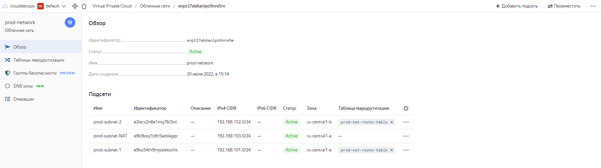
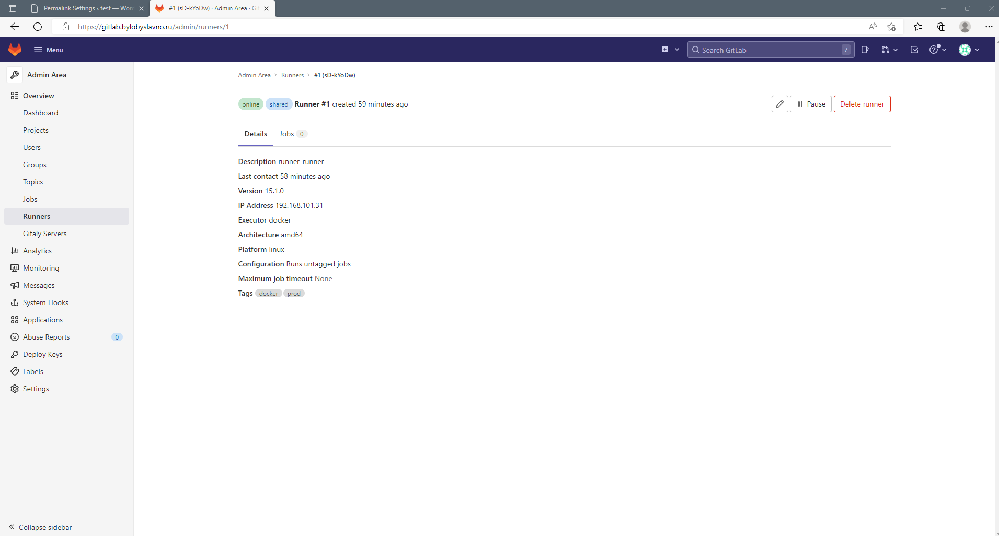

# Дипломное задание по курсу «DevOps-инженер»

Зарегистрированное доменное имя **bylobyslavno.ru** \
DNS хостинг на **Yandex Cloud**

## Terraform

---
В `Terraform` создано два workspace: prod и stage. \
Для бэкенда используется **S3 bucket** Yandex Cloud.


Все ВМ используют образ [CentOS 7](https://cloud.yandex.ru/marketplace/products/yc/centos-7)

[Репозиторий Terraform](https://github.com/nkiselyov/netology_terraform)

`Terraform` создает следующие ресурсы:

1) VPС с подсетями в разных зонах доступности
2) YC `nat instance` и таблицы маршрутизации, привязанные к подсетям с ВМ
3) ВМ для nginx, mysql cluster, wordpress, gitlab-ce, gitlab-runner, monitoring (grafana, prometheus, alertmanager)
4) DNS A-записи в домене bylobyslavno.ru (www, gitlab, grafana, prometheus, alertmanager), которые резолвятся на внешний адрес ВМ с nginx
5) Для первоначальной конфигурации используется `cloud-config` (создание пользователя, настройка ssh, включается Passwordless Sudo)

Для доступ к S3 и каталогу YC используем ключи и IAM-токен для сервисного аккаунта через переменные

```console
export AWS_SECRET_ACCESS_KEY=<access key>
export AWS_ACCESS_KEY_ID=<access key id>
export YC_TOKEN=`yc iam create-token`
```





## Ansible роли

---

Полный пример playbook можно найти [тут](./Playbook/)

**MySQL**

Для настройки кластера MySQL используется роль [mysql-cluster-role](https://github.com/nkiselyov/netology_roles/tree/main/mysql-cluster-role) \
Данная роль:

1) Устанавливает MySQL на серверы
2) Задает пароль пользователю root
3) Удаляет anonymous user и тестовые БД
4) Создает пользователя для репликации с правами REPLICATION SLAVE и REPLICATION CLIENT
5) Настраивает репликацию Master / Slave
6) Создает БД wordpress
7) Создает пользователя wordpress и выдает ему полные права на БД wordpress

Пример:

`inventory`

```yaml
mysql:
  children:
    primary:
      hosts:
        prod-db01:
          ansible_host: 192.168.101.8
          ansible_port: 2222
    replica:
      hosts:
        prod-db02:
          ansible_host: 192.168.102.34
          ansible_port: 2222
```

`group_vars\primary.yml`

```yml
mysql_replication_role: "primary"
```

`group_vars\replica.yml`

```yml
mysql_replication_primary_server: "192.168.101.8"
mysql_replication_role: "replica"
```

Результат

```console
mysql> SHOW GRANTS FOR 'wordpress'@'%';
+----------------------------------------------------------+
| Grants for wordpress@%                                   |
+----------------------------------------------------------+
| GRANT USAGE ON *.* TO `wordpress`@`%`                    |
| GRANT ALL PRIVILEGES ON `wordpress`.* TO `wordpress`@`%` |
+----------------------------------------------------------+
2 rows in set (0.00 sec)

mysql> SHOW SLAVE STATUS\G
*************************** 1. row ***************************
               Slave_IO_State: Waiting for source to send event
                  Master_Host: 192.168.101.8
                  Master_User: replica
                  Master_Port: 3306
                Connect_Retry: 60
              Master_Log_File: mysql-bin.000001
          Read_Master_Log_Pos: 2339
               Relay_Log_File: db02-relay-bin.000003
                Relay_Log_Pos: 326
        Relay_Master_Log_File: mysql-bin.000001
             Slave_IO_Running: Yes
            Slave_SQL_Running: Yes
              Replicate_Do_DB: 
          Replicate_Ignore_DB: 
           Replicate_Do_Table: 
       Replicate_Ignore_Table: 
      Replicate_Wild_Do_Table: 
  Replicate_Wild_Ignore_Table: 
                   Last_Errno: 0
                   Last_Error: 
                 Skip_Counter: 0
          Exec_Master_Log_Pos: 2339
              Relay_Log_Space: 2357
              Until_Condition: None
               Until_Log_File: 
                Until_Log_Pos: 0
           Master_SSL_Allowed: No
           Master_SSL_CA_File: 
           Master_SSL_CA_Path: 
              Master_SSL_Cert: 
            Master_SSL_Cipher: 
               Master_SSL_Key: 
        Seconds_Behind_Master: 0
Master_SSL_Verify_Server_Cert: No
                Last_IO_Errno: 0
                Last_IO_Error: 
               Last_SQL_Errno: 0
               Last_SQL_Error: 
  Replicate_Ignore_Server_Ids: 
             Master_Server_Id: 1
                  Master_UUID: 35b7625b-0826-11ed-94d9-d00d63d45f09
             Master_Info_File: mysql.slave_master_info
                    SQL_Delay: 0
          SQL_Remaining_Delay: NULL
      Slave_SQL_Running_State: Replica has read all relay log; waiting for more updates
           Master_Retry_Count: 86400
                  Master_Bind: 
      Last_IO_Error_Timestamp: 
     Last_SQL_Error_Timestamp: 
               Master_SSL_Crl: 
           Master_SSL_Crlpath: 
           Retrieved_Gtid_Set: 
            Executed_Gtid_Set: 
                Auto_Position: 0
         Replicate_Rewrite_DB: 
                 Channel_Name: 
           Master_TLS_Version: 
       Master_public_key_path: 
        Get_master_public_key: 0
            Network_Namespace: 
1 row in set, 1 warning (0.00 sec)
```

**WordPress**

Для настройки `Wordpress` используется роль [wordpress](https://github.com/nkiselyov/netology_roles/tree/main/wordpress) \
Данная роль:

1) Устанавливает и конфигурирует `Apache`, `PHP` (используется `remi-php74`)
2) Устанавливает и конфигурирует `Wordpress`

Пример:

`inventory`

```yaml
wordpress:
  hosts:
    wordpress-01:
      ansible_host: 192.168.101.13
      ansible_port: 2222
```

`group_vars\wordpress.yml`

```yml
wordpress_site_url: "https://www.bylobyslavno.ru"
wordpress_db_address: 192.168.101.8
wordpress_server_name: 192.168.101.13
```


**gitlabce-role**

Для настройки `Gitlab-CE` используется роль [gitlabce-role](https://github.com/nkiselyov/netology_roles/tree/main/gitlabce-role) \
Данная роль:

1) Устанавливает `Gitlab-CE`
2) Задает первоначальный пароль для root пользователя
3) Задает первоначальный token для shared runners
4) Отключает прослушивание на https
5) Указывает порт прослушивания 80
6) Задает в настройках адрес reverse proxy

Пример:

`inventory`

```yaml
gitlabce:
  hosts:
    gitlab-ce01:
      ansible_host: 192.168.101.4
      ansible_port: 2222
```

`group_vars\gitlabce.yml`

```yml
gitlab_initial_runner_registration_token: "5A2jF7ka5bY"
reverse_proxy_address: "192.168.101.15"
external_url: "https://gitlab.bylobyslavno.ru"
gitlab_initial_pass: "123QWEasdzxc__"
```

**gitlabrunner-role**

Для установки и подключения `Gitlab Runner` используется роль [gitlabrunner-role](https://github.com/nkiselyov/netology_roles/tree/main/gitlabrunner-role) \
Данная роль:
1) Устанавливает `Gitlab Runner`
2) Устанавливает `Docker`
3) Добавляет пользователя gitlab-runner и группу docker
4) Добавляет запись в /etc/hosts с указанием внешнего адреса gitlab. Это необходимо, так как раннер использует для доступа к `git` https://gitlab.bylobyslavno.ru, который резолвится во внутренний IP адрес и не может ответить на 443 порту
5) Регистрирует раннер с docker executor. Для раннера прописывается extra_hosts с указанием внешнего адреса gitlab.

Пример:

`inventory`

```yaml
gitlabrunner:
  hosts:
    gitlab-runner01:
      ansible_host: 192.168.101.31
      ansible_port: 2222
```

`group_vars\gitlabrunner.yml`

```yml
gitlab_url: "http://192.168.101.4"
gitlab_token: "5A2jF7ka5bY"
gitlab_external_host: "gitlab.bylobyslavno.ru"
gitlab_external_ip: "62.84.125.217"
```


**monitoring**

Для настройки мониторинга и оповещения используется роль [monitoring-role](https://github.com/nkiselyov/netology_roles/tree/main/monitoring-role) \
Данная роль:
1) Создает пользователя nodeexporter и устанавливает `Node Exporter` на все сервера, для которых указано `is_nodeexporter: true`
2) Создает пользователя mysqldexporter и устанавливает `Mysqld Exporter` на все сервера, для которых указано `is_mysqldexporter: true`. Также создается пользователь mysqldexporter в кластере MySQL с правами PROCESS, REPLICATION CLIENT, SELECT
3) Устанавливает и конфигурирует `Prometheus` на все сервера, для которых указано `is_prometheus: true`. Добавляет таргеты через file_sd_configs, добавляет правила для оповещения ( [Awesome Prometheus alerts](https://awesome-prometheus-alerts.grep.to/rules.html) )
4) Устанавливает и конфигурирует `Grafana` на все сервера, для которых указано `is_grafana: true`. Добавляет дашборды [Node Exporter Full](https://grafana.com/grafana/dashboards/1860) и [MySQLd Mixin](https://github.com/prometheus/mysqld_exporter/tree/main/mysqld-mixin)
5) Устанавливает и конфигурирует `Alertmanager` на все сервера, для которых указано `is_alertmanager: true`

Пример:

`inventory`

```yaml
monitoring:
  hosts:
    prometheus-01:
      ansible_host: 192.168.101.5
      ansible_port: 2222
```

`group_vars\monitoring.yml`

```yml
is_alertmanager: true
is_prometheus: true
is_grafana: true
```

`group_vars\all.yml`

```yml
is_nodeexporter: true
```

`group_vars\mysql.yml`

```yml
is_mysqldexporter: true
```


**nginx-role**

Для конфигурирования `Nginx` reverse proxy используется роль [nginx-role](https://github.com/nkiselyov/netology_roles/tree/main/nginx-role) \
Данная роль:
1) Устанавливает и конфигурирует nginx с поддержкой TLS
2) Устанавливает certbot и certbot-nginx
3) Создает отдельные конфиги для каждого upstream в /etc/nginx/conf.d/, если задана переменная `add_config:true`
4) Запрашивает и устанавливает сертификаты LetsEncrypt, если задана переменная `new_cert: false`. По умолчанию запрашиваются тестовые сертификаты. Для запроса боевых необходимо указать `letsencrypt_staging: false`

Пример:

`inventory`

```yaml
nginx:
  hosts:
    nginx-01:
      ansible_host: 192.168.101.15
      ansible_port: 2222
```

`group_vars\nginx.yml`

```yml
sites:
  - domain: www.bylobyslavno.ru
    upstreams:
      - { backend_address: 192.168.101.13, backend_port: 80 }
    proxy_pass: http://www.bylobyslavno.ru
    new_cert: true
    add_config: true
  - domain: gitlab.bylobyslavno.ru
    upstreams:
      - { backend_address: 192.168.101.4, backend_port: 80 }
    proxy_pass: http://gitlab.bylobyslavno.ru
    new_cert: true
    add_config: true
  - domain: grafana.bylobyslavno.ru
    upstreams:
      - { backend_address: 192.168.101.5, backend_port: 3000 }
    proxy_pass: http://grafana.bylobyslavno.ru
    new_cert: true
    add_config: true
  - domain: prometheus.bylobyslavno.ru
    upstreams:
      - { backend_address: 192.168.101.5, backend_port: 9090 }
    proxy_pass: http://prometheus.bylobyslavno.ru
    new_cert: true
    add_config: true
  - domain: alertmanager.bylobyslavno.ru
    upstreams:
      - { backend_address: 192.168.101.5, backend_port: 9093 }
    proxy_pass: http://alertmanager.bylobyslavno.ru
    new_cert: true
    add_config: true
email: nkiselyov94@gmail.com
letsencrypt_staging: false
```

```console
[nikita@bylobyslavno conf.d]$ ls
alertmanager.bylobyslavno.ru.conf  gitlab.bylobyslavno.ru.conf  grafana.bylobyslavno.ru.conf  prometheus.bylobyslavno.ru.conf  www.bylobyslavno.ru.conf

[nikita@bylobyslavno conf.d]$ cat gitlab.bylobyslavno.ru.conf 
upstream gitlab.bylobyslavno.ru {
    server 192.168.101.4:80;
}

server {
    server_name gitlab.bylobyslavno.ru;
    location / {
       proxy_pass http://gitlab.bylobyslavno.ru;
       proxy_set_header        X-Real-IP $remote_addr;
       proxy_set_header        X-Forwarded-For $proxy_add_x_forwarded_for;
       proxy_set_header        X-Forwarded-Proto $scheme;
       proxy_set_header        Host $host;
    }

    listen 443 ssl; # managed by Certbot
    ssl_certificate /etc/letsencrypt/live/gitlab.bylobyslavno.ru/fullchain.pem; # managed by Certbot
    ssl_certificate_key /etc/letsencrypt/live/gitlab.bylobyslavno.ru/privkey.pem; # managed by Certbot
    include /etc/letsencrypt/options-ssl-nginx.conf; # managed by Certbot
    ssl_dhparam /etc/letsencrypt/ssl-dhparams.pem; # managed by Certbot

}


server {
    if ($host = gitlab.bylobyslavno.ru) {
        return 301 https://$host$request_uri;
    } # managed by Certbot


    listen 80;
    server_name gitlab.bylobyslavno.ru;
    return 404; # managed by Certbot


}
```

## Скриншоты веб-интерфейсов всех сервисов работающих по HTTPS
---


## Настройка Gitlab CI/CD
---

**Цель**\
При любом коммите в репозиторий с WordPress и создании тега (например, v1.0.0) происходит деплой на виртуальную машину


Файл `.gitlab-ci.yml`

```yaml
stages:
  - deploy

variables:
  PROD_PATH: "/var/www/wordpress"
  DEPLOY_USER: "deployment"
  DEPLOY_SERVER: "192.168.101.13"

deploy_wordpress:
  only:
    - main
    - tags
  image: alpine:latest
  stage: deploy
  before_script:
    - chmod og= $ID_RSA
    - apk update
    - apk add openssh-client rsync
  script:
    - rsync -avz -e "ssh -i $ID_RSA -o StrictHostKeyChecking=no -p 2222" --exclude ".git" --rsync-path="sudo rsync" --exclude ".gitlab-ci.yml" --exclude "README.md" --progress $CI_PROJECT_DIR/* $DEPLOY_USER@$DEPLOY_SERVER:$PROD_PATH
    - ssh -i $ID_RSA -o StrictHostKeyChecking=no -p 2222 $DEPLOY_USER@$DEPLOY_SERVER "sudo chmod -R 0775 $PROD_PATH"
    - ssh -i $ID_RSA -o StrictHostKeyChecking=no -p 2222 $DEPLOY_USER@$DEPLOY_SERVER "sudo chown -R apache:apache $PROD_PATH"
    - ssh -i $ID_RSA -o StrictHostKeyChecking=no -p 2222 $DEPLOY_USER@$DEPLOY_SERVER "sudo systemctl restart httpd"
```

Для проекта задаем protected переменную ID_RSA с типом file. В нее помещает приватный SSH ключ пользователя deployment, чтобы была возможность подключаться на сервер wordpress.

Также для проекта делаем все тэги `v*` защищенными. Без этого не будет использоваться переменная ID_RSA для деплоя при создании тэга и pipeline завершится с ошибкой.

В pipeline используется только один stage. Этот stage содержит задачу `deploy_wordpress`. В ней используется `Docker` образ `alpine:latest`, на который устанавливается `openssh-client` и `rsync`. Задача запускается только при коммите в ветке `main` или создании тэга.

Задача состоит из скрипта, который через `rsync` копирует файлы из репозитория в папку с проектом на сервере, устанавливает для них владельцем УЗ apache и группу apache, меняет права на 0775 и перезапускает веб-сервер для применения изменений.

Пример:

Добавим в файл wp-blog-header.php строку "/* test CI/CD Pipeline". После коммита отрабатывает pipeline


На сервере файл также изменился

```console
[nikita@app wordpress]$ sudo cat wp-blog-header.php
<?php
/**
 * Loads the WordPress environment and template.
 *
 * @package WordPress
 */

if ( ! isset( $wp_did_header ) ) {

        $wp_did_header = true;

        // Load the WordPress library.
        require_once __DIR__ . '/wp-load.php';

        // Set up the WordPress query.
        wp();

        // Load the theme template.
        require_once ABSPATH . WPINC . '/template-loader.php';

}

/* test CI/CD Pipeline
```
